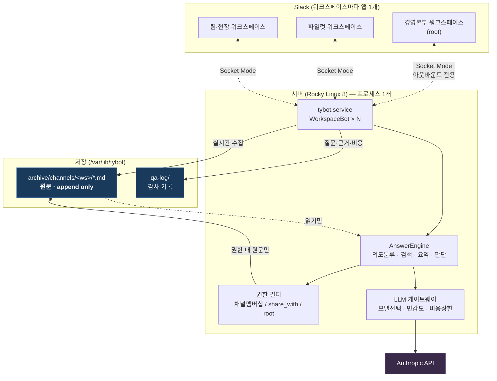
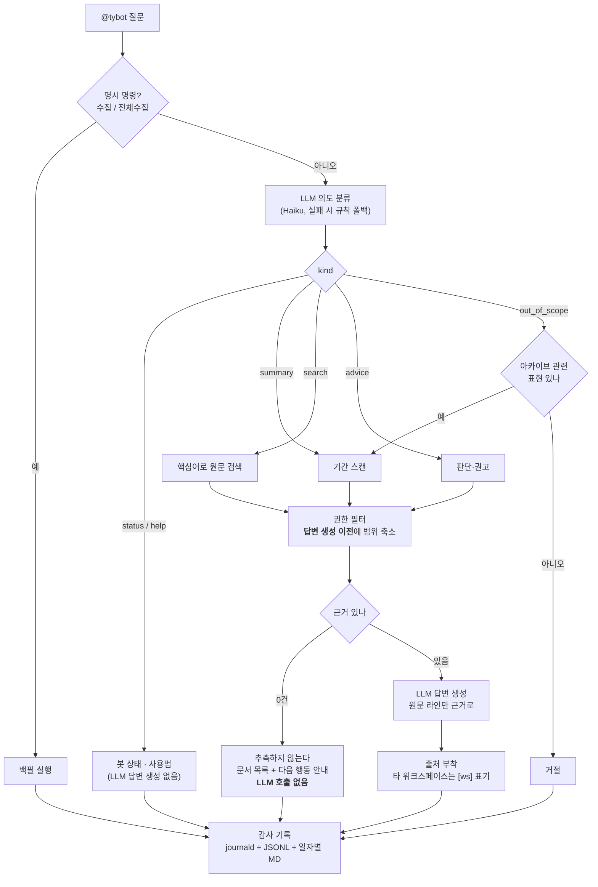
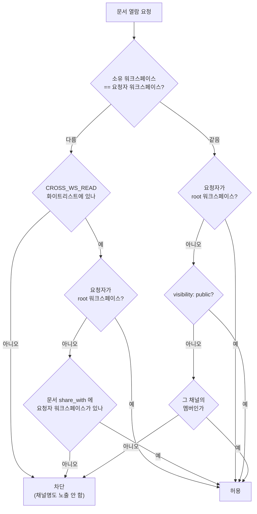
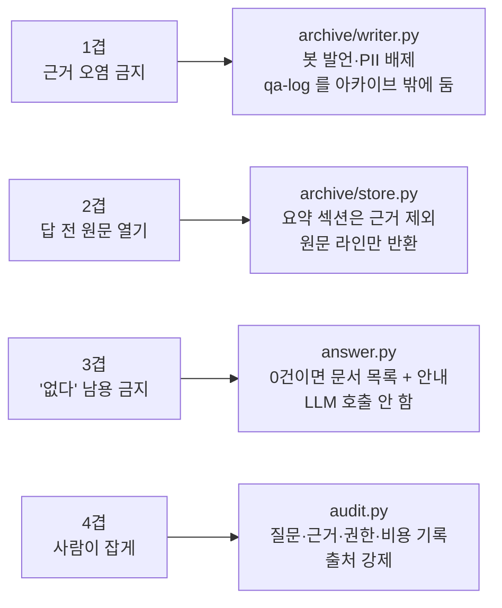

# TYBot

태영건설 Slack AI TFT — 워크스페이스별 봇이 대화를 수집해 **MD 아카이브**로 자산화하고,
**권한이 허용된 원문만 근거로** 답한다. 근거가 없으면 추측하지 않는다.

- 설계 원칙·컨벤션: [`CLAUDE.md`](CLAUDE.md), [`AGENTS.md`](AGENTS.md)
- **파일럿 런북(여기부터)**: [`docs/pilot/README.md`](docs/pilot/README.md)
- 서버 배치(Rocky Linux 8): [`docs/deploy/rocky8.md`](docs/deploy/rocky8.md)
- **멀티 워크스페이스 · 권한 3층**: [`docs/multi-workspace.md`](docs/multi-workspace.md)
- 에이전트 구조(마스터봇·정리봇 검토): [`docs/design/agent-architecture.md`](docs/design/agent-architecture.md)
- **그룹웨어 Oracle → PostgreSQL 동기화**: [`docs/design/oracle-sync.md`](docs/design/oracle-sync.md)
  - 인프라·보안 담당자 요청서: [`docs/deploy/infra-request-snapshot-push.md`](docs/deploy/infra-request-snapshot-push.md)
- 사용자 식별·그룹웨어 인증 검토: [`docs/design/identity-and-legacy-login.md`](docs/design/identity-and-legacy-login.md)
- DB 선택·조직 권한 설계: [`docs/design/db-and-acl.md`](docs/design/db-and-acl.md) · [PG vs MariaDB](docs/design/postgres-vs-mariadb.md)
- 전체 아키텍처(기획): [`docs/architecture.md`](docs/architecture.md)

---

## 전체 구조



**인바운드 포트 0개.** Socket Mode 는 봇이 Slack 으로 나가는 WebSocket 이다.

---

## 질문 처리 흐름



---

## 권한 3층 (독립된 축)



| 축 | 통제 대상 | 정하는 주체 |
|---|---|---|
| 채널 멤버십 | 같은 워크스페이스에서 어느 채널을 보나 | Slack 초대 |
| `share_with` | 이 문서를 어느 **동등** 워크스페이스에 넘길지 | 자료 소유 쪽 사람 |
| root 워크스페이스 | 산하 자료를 취합·열람하는 상위 조직 | 서버 운영자(`ROOT_WORKSPACES`) |

**막는 쪽이 기본값.** 수집기는 원문을 항상 `private` 로 저장하므로, 자동으로 워크스페이스를
넘어가는 자료는 없다. 자세한 내용은 [`docs/multi-workspace.md`](docs/multi-workspace.md).

---

## 환각 방지 4겹이 코드에 박힌 위치



---

## 개발 환경

```bash
python -m venv .venv && .venv/Scripts/activate    # Windows
pip install -e ".[dev]"
cp .env.example .env                              # 값은 직접 입력, 커밋 금지
pytest                                            # 116 tests
python -m tybot.slack.pilot                       # 로컬 기동
```

> `.env` 는 인라인 주석(`VAR=값  # 설명`)을 쓰지 않는다. 설명은 줄 앞에 단독으로 둔다.

## 구조

```
src/tybot/
├── slack/pilot.py      # 워크스페이스 봇 (Socket Mode, N개 연결)
├── answer.py           # 질의응답 파이프라인 (검색 / 요약 / 판단)
├── intent.py           # 의도 분류 (LLM + 규칙 폴백)
├── access/             # 권한 3층 판정
├── archive/            # store.py=원문 검색 / writer.py=원문 수집
├── audit.py            # 질의응답 감사 기록
├── workspaces.py       # 멀티 워크스페이스 설정 · 크로스 열람 화이트리스트
├── envfile.py          # 설정 파일 로딩(봇·점검 스크립트 공용)
├── gateway/            # LLM 게이트웨이 (모델선택·민감도·비용가드)
└── config.py

deploy/     install.sh · tybot.service · update.sh(자동배포) · wheelhouse.sh
scripts/    check_env.py(설정 점검) · share.py(공유 설정)
```

## LLM 게이트웨이

모든 LLM 호출은 이 라우터를 통한다. 프로바이더 SDK 직접 호출 금지.

```python
from tybot.gateway import Router, Message, Sensitivity

router = Router.from_default_registry(daily_limit_usd=5)
resp = router.complete(
    [Message("user", "이 채널 요약해줘")],
    model="claude-sonnet-5",
    sensitivity=Sensitivity.CONFIDENTIAL,
)
print(resp.text, resp.model, resp.cost_usd)
```

민감도는 모델 티어가 아니라 **벤더 계약(DPA)** 단위로 판정한다. 일별 비용 상한은 전 워크스페이스 합산.
