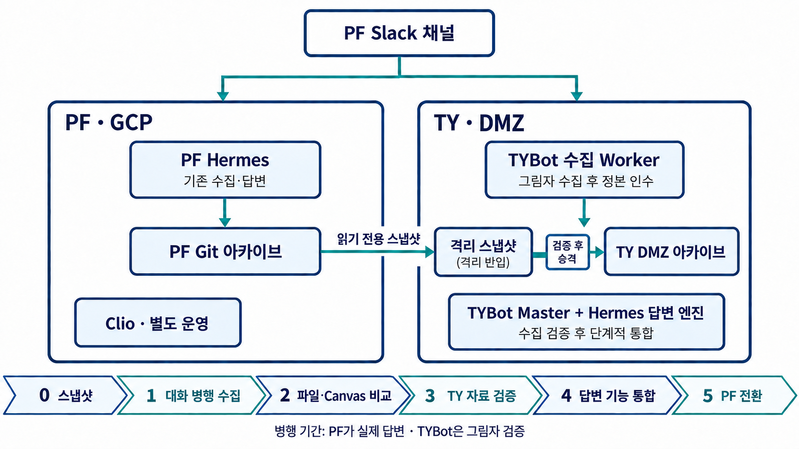
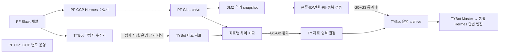

# PF Hermes와 TYBot 단계별 통합 계획

> **2026-09-23 협의로 우선순위 변경:** 이 문서는 이전의 수집 선행안을
> 기록한 것이다. 현재 실행 기준은
> [Archiving Bot 분리와 Hermes 직접 호출](archiving-bot-separation-2026-09-23.md)이다.
> TYBot에서 수정된 PF 원본 Hermes를 먼저 직접 호출하고, Archiving Bot
> 전환과 PF archive의 운영 반입은 검증 후 진행한다.

작성: 2026-09-23
기준: `subbots/hermes_v1.3/hermes-main`, `hermes-archive-tec-main`, `docs/` 조사본
상태: 검토용 제안. PF 측 설계 v2.7의 R1/R2 순서를 바꾸므로 양 팀의 합의가 필요하다.

위 그림은 회의용 개요다. PF Git 스냅샷은 **격리 반입 후 검증**하며 운영 검색 경로에
직접 투입하지 않는다. 실제 반입 경로와 승격 관문은 아래와 같다.

snapshot 격리 경로는 `/var/lib/tybot/imports/pf-hermes/<snapshot-id>/source`다.
G0은 반입 자체의 검증이고, 원문을 운영 archive에 편입하는 승인은 채널·권한·PII·
provenance 검증과 G1~G3 결과를 보고 별도로 결정한다.

## 결론

제안한 방향은 실행 가능하다. 단, **PF writer 중지는 답변 이관 뒤**로 미뤄야 한다.
기존 PF Hermes와 Clio는 GCP에서 계속 서비스하고,
TYBot 수집기를 PF 채널에 **그림자 모드**로 붙여 두 결과를 비교한다. 동일 Slack 원문을
서로 다른 저장소에 수집해 검증하는 것은 가능하지만, **PF 사용자의 답변 정본은 PF Git,
TYBot 평가용 정본은 TY DMZ로 구분**해야 한다. TYBot이 병행 수집 중인 자료를 곧바로
PF 사용자 답변의 근거로 쓰거나
검토 DM을 두 번 발송하지 않도록 한다.

이 계획의 핵심 변경점은 다음과 같다.

| 단계 | PF에서 운영 중인 것 | TYBot에서 새로 검증하는 것 | PF 사용자 답변 근거 |
|---|---|---|---|
| 0. 기준선 | GCP Hermes 수집·답변, Clio | Git archive snapshot을 DMZ 격리 경로로 복제 | PF Git |
| 1. 대화 | 기존 수집 계속 | PF 채널 메시지·스레드·수정/삭제 그림자 수집 | PF Git |
| 2. 파일 | 기존 `doc-archive` 계속 | 첨부·Canvas 수집과 변환 그림자 비교 | PF Git |
| 3. TY 자료 승격 | PF 수집·답변 계속 | 검증된 TY 수집 결과만 TY archive 근거로 승격 | PF Git |
| 4. 답변 | PF GCP 답변을 비교 기준으로 유지 | TYBot Master가 통합 Hermes 답변 엔진을 pilot 호출 | PF Git, pilot은 TY DMZ |
| 5. PF 전환 | Clio 별도 운영, PF Hermes 단계적 종료 | PF 답변 진입점 전환 후 PF writer 중지 | TYBot DMZ |

단계 3은 꼭 필요한 관문이다. 수집 비교가 끝났다고 PF writer를 바로 멈추면 기존
Hermes의 답변과 정기 요약이 읽던 자료가 끊길 수 있다. **DMZ 원문을 개인 GCP로 다시
반출하는 호환 뷰는 기본안에 넣지 않는다.** PF 답변을 TYBot으로 옮겨 검증한 뒤 단계
5에서 PF writer 소유권을 바꾼다.

## 확인된 현재 구조와 차이

- PF: `hermes-main`은 Node.js Slack Bolt 봇으로 수집·검색·답변·정기 요약을 담당한다.
  `hermes-archive-tec-main`의 `slack-export/`에 대화를, `documents/`에 변환 문서를
  보관한다. Clio는 별도 프로세스로 운영된다(P1 조사 §②).
- TY: TYBot Master가 Slack 수집·라우팅을 담당하고 DMZ 서버의 v2 archive를 근거로
  내부 Archive Specialist를 호출한다. 이 내부 specialist는 PF의 실행 중인 Hermes와
  같은 프로그램이 아니다.
- PF의 Claude skill은 `archive-run`, `slack-sync`, `doc-archive`, `archive-inbox`,
  `hermes-install`, **`issue-trim`** 여섯 개다. 이전 v1.2 기반 작업지시서는 마지막
  skill을 빠뜨렸고, 현재 v1.3 자료를 기준으로 수정해야 한다.
- PF P2 조사: 채널 MD 43개, 변환 문서 MD 507개. 색인에는 51개 채널이 있고,
  config에만 있는 3개를 합하면 최소 54개다. 채널 ID 46개는 확인, 8개는 미확정이다.
  이름이나 MD 본문에 등장하는 ID만으로 매핑하면 다른 채널 ID가 뒤바뀌는 실제 사례가
  있다. 첨부 문서 MD에는 원본 file ID가 없는 경우가 있다.
- PF 채널 MD에는 사람 원문과 요약 머리말, 봇 자리표시가 함께 있다. 파일 단위로
  `slack_raw`라고 분류하면 요약과 봇 표식이 TYBot 원문으로 유입된다. 메시지/블록
  단위 분류가 필요하다.
- PF `archive-format.js`는 사람 메시지·답글의 Slack `ts`를 사람이 읽는 표시 시각으로
  바꿔 MD에 쓴다. 기존 MD만으로 모든 메시지의 `(channel_id, ts)`를 복원할 수 없다.
  과거 자료는 출처 좌표가 확인된 항목만 승격하고, 병행 수집 비교를 시작하기 전에
  PF 측에 원본 Slack `ts`가 있는 읽기 전용 sidecar를 마련해야 한다.
- PF `documents/access.js`의 `_승인자료`는 실제 채널이 아닌, 비공개 채널 문서 중
  공개 승인된 자료를 담는 가상 project다. 폴더명으로 채널 ID나 공개 권한을 추정할
  수 없으며 승인 증거가 없는 문서는 비공개로 취급한다.

### 기능별 이관 결정

| PF Hermes에서 확인할 동작 | TYBot 측 목표 | 소유권 |
|---|---|---|
| `slack-sync`·`archive-run`: 커서, 재시도, 부분 실패, edit/delete, 누락 검사 | TYBot worker에 빠진 의미를 이식하고 기존 수집 관문에 붙임 | TY 수집 worker |
| `doc-archive`: 파일 발견, 변환, 실패·제외 판정 | TYBot 파일 worker에 차이만 반영, 원본 file ID와 권한 유지 | TY 파일 worker |
| `archive-inbox`·`issue-trim`: 사람 검토 후보와 파생 요약 | TYBot 검토 DM·승인 상태와 비교. 원문 저장·검색에 섞지 않음 | TY 검토·파생물 |
| `hermes-install`: GCP 설치와 개인 Git 운영 | 코드 이식 없음. TYBot console/preflight 기준에 필요한 검사만 채택 | TY 운영 |
| PF 검색·답변·프롬프트 | G4에서 평가 후 TYBot Hermes 답변 엔진으로 선택 이식 | TY specialist |
| Slack 명령 처리·라우팅·ACL·최종 전송 | PF 코드로 덮어쓰지 않음 | TYBot Master |

`skill` 파일 자체를 TYBot 런타임으로 옮기는 작업은 아니다. PF 개발자는 입력·출력과
실패 상태를 설명하고 비교용 산출물을 제공하며, TY 개발자는 해당 동작을 TYBot의
수집·검토·답변 경계에 구현한다.

## 0단계: archive 기준선 반입

**목적:** PF Git archive의 특정 commit을 DMZ에 읽기 전용으로 복제하고 재현 가능한
기준선을 확보한다. 이 단계에서 TYBot 검색에 넣지 않는다.

- PF 개발자: 자료 Git full SHA, 기준 시각, 채널 ID·visibility·상태 표, 미확정 8개,
  `.sync-state.json` 기준점, 제외/승인 메타의 의미를 제출한다. snapshot 이후의
  증분을 다시 낼 방법을 함께 명시한다.
- TY 오너: 제한된 전달 경로와 보관 권한을 확정하고 원본 Git과 DMZ 복제본의 SHA 및
  파일별 hash를 대조한다.
- TY 개발자: `/var/lib/tybot/imports/pf-hermes/<snapshot-id>/source`에 격리하고
  source/derived/unknown 목록을 생성한다. 메시지 좌표가 없거나 private 여부가
  불명확한 항목은 운영 검색 대상에서 제외한다.
- 완료 증거: commit/hash 일치, 수량 보고서, 미확정 목록, live TYBot archive 변경 0.

자료 실물은 `subbots/hermes_v1.3/hermes-archive-tec-main`에도 들어 있으므로 해당 폴더를
공개 코드 저장소에 추가하거나 운영 자료를 테스트 fixture로 복사하지 않는다.

## 1단계: 대화 수집을 병행해 비교

**범위:** 우선 PF 공개 채널 2~3개와 초대·권한이 확인된 비공개 채널 1개. 이후 전체
대상 채널로 확대한다. 두 수집기가 각각 자기 저장소에 쓰되, TYBot 복제본은 이 기간
PF 사용자 답변·검토 발송의 정본으로 쓰지 않는다.

착수 전 PF와 TYBot의 Slack 앱·토큰·이벤트 구독·채널 멤버십을 확인한다. **같은 봇
토큰으로 두 Socket Mode 인스턴스를 띄우지 않는다.** 서로 다른 앱으로 관찰하더라도
API 한도와 재시도 부하, private 채널 접근 범위를 측정한다. TYBot 그림자 경로의
답변·Canvas 작성·검토 DM을 막는 feature flag를 구현하고 실제 전송 0건을 점검한다.

- PF 개발자: 기존 Hermes 수집에서 채널별 watermark, 실패·부분 수집, 편집·삭제 감지,
  봇 자리표시의 의미를 추출하는 읽기 전용 비교 산출물을 제공한다. 신규 병행 구간은
  Slack 원본 `(channel_id, ts, thread_ts)`가 있는 sidecar 또는 동등한 이벤트 manifest를
  남긴다. GCP의 수집과 질의응답이 분리 가능한 제어 지점도 확인한다.
- TY 개발자: PF workspace를 TYBot 수집 대상에 등록하고 대상 채널을 허용 목록으로
  제한한다. 동일한 관찰 구간을 정해 메시지·스레드·수정·삭제 이벤트를 기록한다.
  summary review·DM·정기 요약·답변 전송은 그림자 경로에서 억제한다.
- 비교 키: `(workspace_id, channel_id, message_ts, thread_ts, revision)`.
  원문 텍스트 hash, bot/human 구분, 첨부 ID 목록, 수집 시각을 대조한다.
- PF 기존 MD에는 `ts`가 없는 사람이 작성한 항목이 있으므로 이 키는 **신규 병행
  수집 구간에서 양쪽이 Slack 좌표를 남긴 뒤에만** 적용한다. 과거 MD의 표시 시각과
  본문이 닮았다는 이유만으로 자동 일치·중복 제거하지 않는다.
- 보고: 채널별 기대/실제/누락/중복/수정·삭제 미반영/미열람/권한 차단 건수를
  구분한다. `0건`, `미확인`, `읽기 실패`는 서로 다른 상태다.
- 완료 조건: 비교 대상 중 **접근 가능한 원문·스레드의 설명되지 않은 누락 0건**,
  비공개 노출 0건, 봇 본문 재수집 0건. PF의 접근 불가 채널은 성공률 분모에 숨기지
  않고 사유와 오너를 붙여 별도 보류한다.

### 비교 시 주의

PF MD는 채널별 최신→과거, TYBot은 날짜별 파일이다. MD 파일 hash나 줄 수를 그대로
대조하면 형식 차이를 오류로 오인한다. 동일 Slack 좌표로 정규화한 이벤트를 비교하고,
편집/삭제는 양쪽의 시점과 승인 정책 차이를 따로 평가한다. PF의 `issue-trim`으로 줄인
채널 쟁점 머리말은 사람 원문과 별도 파생물로 비교한다.

## 2단계: 파일·Canvas 수집 및 변환 비교

**선행 조건:** 1단계의 채널 ID와 원문 좌표 비교가 안정적이어야 첨부의 소속을 증명할
수 있다. 파일 비교는 메시지 파일 목록과 Slack `files.info`를 기준으로 한다.

- PDF, HWP/HWPX, DOCX, PPTX, XLSX 등 대표 형식과 표·이미지·다중 시트를 포함한다.
  미지원 형식은 성공으로 세지 않고 별도 상태로 둔다.
- 동일 `file_id`와 버전/원문 링크로 존재 여부, 다운로드, 변환 상태, 페이지·시트 수,
  표와 숫자·날짜·금액 보존을 비교한다. 문자열 전체 일치보다 필수 정보 누락을
  중심으로 수동 표본 검토한다.
- Canvas 본문, Canvas에 달린 첨부, TYBot이 만든 답변/검토 Canvas를 구분한다.
  봇 생성 Canvas는 다시 근거로 넣지 않는다.
- PF `doc-archive`의 사람 승인/제외와 TYBot 자동 변환·PII·검토 절차의 차이를
  상태표로 문서화한다. PF의 승인 기록을 TYBot의 검토 완료로 자동 승격하지 않는다.
- PF의 원본 바이너리는 자료 Git에 없을 수 있으므로 변환 MD만으로 파일 수집 성공을
  판정하지 않는다. 원본 Slack file ID와 현재 접근 권한으로 재다운로드 가능한지 별도
  확인한다. 실물 전달이 필요하면 암호화·접근권한·보존기간을 오너가 먼저 승인한다.
- 완료 조건: 대상 파일의 **설명되지 않은 누락 0건**, 숫자·표의 치명 손실 0건,
  private 자료 유출 0건, 부분/실패/미지원의 구분과 재시도 경로 확인.

## 3단계: TY 자료 검증과 승격

PF GCP Hermes는 수집·답변 서비스를 그대로 계속한다. TYBot 쪽에서는 비교에 합격한
채널·메시지·첨부만 운영 archive의 PF workspace 근거로 승격한다. 미확정 ID, 과거 MD의
출처 불명 항목, 부분 변환은 제외 또는 격리한다. TYBot Master의 PF 사용자 대상 답변과
검토 DM은 아직 켜지 않는다.

1. 검증된 TY 수집 범위와 제외 범위를 채널 ID별로 고정한다.
2. source snapshot과 shadow 수집분의 중복을 Slack 좌표로 해소한다. 좌표 없는 과거
   항목은 자동 병합하지 않는다.
3. PII·권한·bot/derived 제외 관문을 통과한 자료만 TY 검색 대상으로 승격한다.
4. 승격 전후 문서 수, 원문 좌표 수, 검색 노출 범위와 출처 링크를 대사한다.

이 시점에는 PF Git과 TY DMZ가 각각 **다른 사용자 경로의 자료 공급원**이다. 하나의
운영 writer로 통합된 것은 아니다. PF GCP 서비스를 끄거나 DMZ 자료를 GCP로 반출하지
않는다.

## 4단계: Hermes 답변 기능을 TYBot에 통합

자료 전환과 독립된 품질 관문이다. PF Hermes의 답변 품질을 만든 것은 프롬프트뿐 아니라
검색·부분 일치·자동 채널 좁힘·문서 구간 읽기·캐시·실시간 스레드 맥락이다.

- TYBot Master: 사용자·응답 장소·권한 범위, 후속 질문의 원문 좌표, specialist 선택,
  중복 전송 방지를 소유한다.
- 통합 Hermes 답변 엔진: 허용된 자료에서 검색 전략을 고르고 원문을 읽어 출처 있는
  답을 만든다. PF의 기존 답변 기능을 하나씩 이식하거나 별도 호출 엔진으로 연결하되
  같은 평가셋에서 실제 모델 입력과 도구 결과까지 비교한다.
- Archive worker: 수집·변환·ACL·버전·출처 좌표를 소유한다. 답변 엔진은 원문을 쓰거나
  Slack 수집기를 직접 가동하지 않는다.
- Clio: 이번 전환의 대상이 아니다. 기존 PF 호출을 유지하며 TYBot 연동은 별도 계약과
  평가를 거쳐 진행한다.

PF v1.3 설계서의 20문항 평가셋, 권한·출처·최신성·완전성·비용·평균/p95 응답시간·
완료율·복귀 조건을 인수 기준으로 사용한다. 동일 질문에 사용자에게 전달되는 답변은
한 건만 유지하고 그림자 답변은 제한된 평가 환경에만 기록한다.

## 5단계: PF 진입점과 writer 전환

1. 채널별로 PF 사용자의 질문 전달자를 TYBot으로 전환한다. GCP Hermes는 해당 채널에서
   응답을 보내지 않도록 하고, 중복 답변·권한·후속 질문을 감시한다.
2. PF 정기 요약과 Clio 호출의 새 소유자가 확정되기 전까지 기존 기능을 중단하지 않는다.
   Clio 자체 이관은 별도 과제다.
3. PF Hermes의 **수집·Git 쓰기만** 독립적으로 멈출 수 있는지 시험한다. checkpoint와
   진행 중 작업을 기록하고 drain한다. 전체 GCP 서비스를 먼저 중지하지 않는다.
4. TYBot writer가 마지막 PF watermark 이후 delta를 대사한다. 늦게 도착한 PF 쓰기를
   차단하고 TYBot을 PF 채널의 유일한 운영 수집 writer로 지정한다.
5. 복귀 시험은 PF 답변 진입점과 수집 writer를 따로 검증한다. 이미 TY DMZ에만 있는
   새 원문을 PF Git으로 되돌려야 한다면 보안 승인과 검증된 증분 절차가 필요하다.

PF 수집과 답변을 분리할 수 없거나 새 진입점의 품질이 미달이면 PF writer를 유지하고
전환을 보류한다. 이 조건에서는 병행 수집 비교를 계속할 수 있다.

## 일정과 결정 관문

| 관문 | 인수 산출물 | 결정 |
|---|---|---|
| G0 | snapshot SHA/hash, 채널 mapping, 불명확 자료 목록 | 병행 수집 시작 |
| G1 | 원문·스레드·수정/삭제 차이 보고서 | 파일 비교 확대 |
| G2 | 파일·Canvas 변환 품질/누락/권한 보고서 | writer 전환 준비 |
| G3 | TY 자료의 PII/ACL/provenance·중복·검색 노출 검사 | TY 근거 승격, PF는 현행 유지 |
| G4 | 동일 평가셋 답변·비용·지연·보안 비교 | TYBot 답변 pilot |
| G5 | PF pilot, 수집/답변 분리, 마지막 delta, Clio 영향·복귀 시험 | PF 진입점 및 writer 전환 |

관찰 기간은 주말, PF 07:00/17:00 수집, TYBot 변환 재시도, 검토 발송과 최소 한 번의
정기 요약 주기를 포함하도록 정한다. 단순히 며칠 지났다는 이유로 통과시키지 않는다.

## 기존 문서와의 관계

- `subbots/hermes_v1.3/docs/260922_TYBot-Hermes-직접호출-통합_설계.md`는 **답변 연결을
  먼저 시험하는 R1/R2 순서**다. 이 문서는 오너가 제안한 **수집 검증 선행** 순서를
  기술한다. 구현 전에 양 팀이 어느 관문을 먼저 열지 합의해야 한다.
- `pf-hermes-developer-work-order.md`는 v1.2 기반 snapshot exporter 중심 지시서다.
  v1.3의 `issue-trim`, writer 병행 비교와 G5 전환이 빠져 있으므로 현재 통합 작업의
  단독 실행 지시서로 쓰지 않는다.
- `pf-hermes-owner-plan.md`의 2026-09-23 오전 snapshot 반입은 이 계획의 0단계다.
  운영 소스 배포나 TYBot 검색 반영까지 완료된 것으로 간주하지 않는다.
